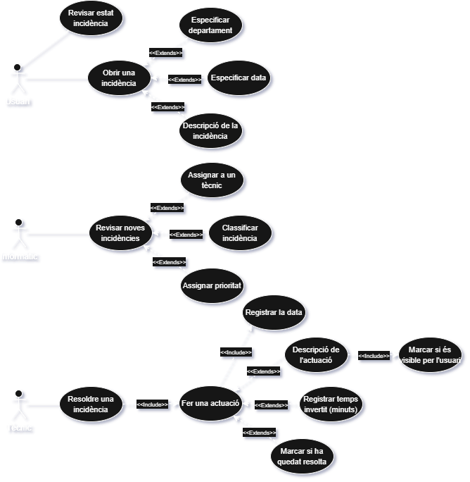

# Wasp

## Indice

## Objectiu breu del projecte

Desenvolupar una aplicació web per registrar, gestionar i fer seguiment d’incidències informàtiques dins de l'institut. El sistema permet la comunicació entre usuaris, tècnics i responsables informàtics, així com la generació d’informes i estadístiques.

## Diagrama casos d'us

