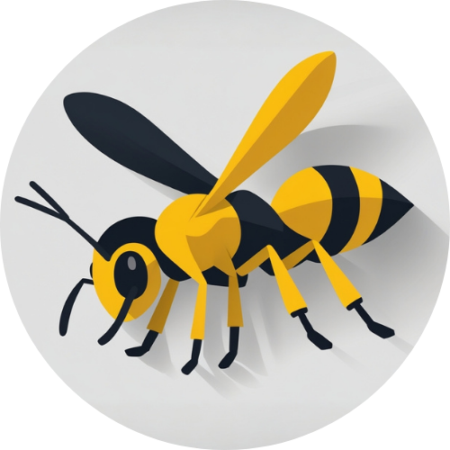

<h1 align="center">
  <br>
  <a href="https://www.youtube.com/watch?v=EKop9AUitvA"></a>
  <br>
  Wasp
  <br>
</h1>

<h4 align="center">A Modifiable Issue Web Page with Docker Compose.</h4>

<div align="center">
  
  
  
  
  
  
</div>

<div align="center">

[🔑 Key Features](#🔑-key-features) • [🛠️ How To Use](#🛠️-how-to-use) • [🧩 Units](#🧩-units) • [🗄️ Database](#️🗄️-database) • [🔗 Related](#🔗-related)

</div>

---


## 🔑 Key Features

Develop a web application to record, manage and track computer incidents within a company, institute or others. The system allows communication between users, technicians and IT managers, as well as the generation of reports and statistics.

## 🛠️ How To Use

To get started with Wasp, follow these steps:

Clone the repository
Use Git to download the project to your local machine:

```bash
git clone https://github.com/inspedralbes/projecte-1dam-24-25-dam1pj2
cd wasp/
```

Set up environment variables
Create a `.env` file at the root of the project with all required configuration values. This may include the application port, database credentials, session secrets, etc.

Start the app using Docker Compose
The project is containerized using Docker and Docker Compose. Build and start all services with:

```bash
docker compose up --build
```

Access the app in your browser
Once everything is up and running, you can access the application at `http://localhost:3000` or whatever port you’ve configured.

This will launch the full application stack, including the database and the backend server, ready for development or testing.

If you need have the application in the background, you can use:

```bash
docker compose up -d
```

## 🧩 Units

asd

## 🗄️ Database

The Page-Wasp Incident Management System uses two databases: MySQL for core application data and MongoDB for logging. MySQL stores structured data such as incidents, users, departments, categories, and technician actions, all managed via Sequelize ORM.

The MySQL connection is set up in db.js, with model relationships and sample data initialized in app.js. Adminer is included for easy web-based database management.

MongoDB handles unstructured logging data, like user activity and usage stats. It’s connected in app.js and uses a simple schema in Stats.js, with logs recorded via middleware.

Both databases are configured in the docker-compose.yml file, along with Adminer (for MySQL) and Mongo Express (for MongoDB). This separation improves scalability, maintainability, and performance.

## 🔗 Related

If you're interested in learning more or extending the project, here are some useful links:

- [Explanation Scripts – Step-by-step code walkthrough](/doc/Explanation-Scripts.md)  
- [Faq – Common questions answered](/doc/Frequently-Asked-Questions.md)  
- [User Guide – How to use the system](/doc/User-Guide.md)

<p align="right">(<a href="#🔑-key-features">back to top</a>)</p>